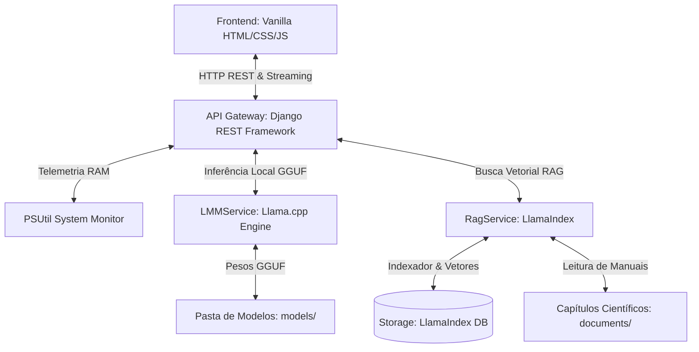

# Documentação do Projeto - Secagem Digital AI 🌾🤖

Bem-vindo à documentação oficial do **Secagem Digital AI**, uma solução industrial de ponta projetada para assistência técnica inteligente no setor agrícola e industrial. Este sistema foi desenvolvido para monitorar silos de armazenagem de grãos e otimizar processos de secagem, unindo o conhecimento clássico de engenharia agrícola a modelos de linguagem multimodal locais de última geração.

---

## 🌟 Visão Geral do Sistema

O **Secagem Digital AI** resolve um dos maiores desafios do agronegócio moderno: a otimização de custos e processos na secagem e conservação de grãos, operando de forma **totalmente local**.

### Por que Local?
* **Privacidade de Dados Industriais**: As métricas de colheita, volumes de estoque, custos operacionais e imagens térmicas não são compartilhados com APIs de terceiros na nuvem.
* **Latência Zero e Disponibilidade**: Em instalações rurais distantes ou silos isolados com baixa ou nenhuma conectividade com a internet, o sistema funciona localmente sem interrupções.
* **Alta Performance e Baixo Custo**: Utiliza modelos quantizados no formato **GGUF** rodando em processadores comuns ou acelerados por placas de vídeo dedicadas (GPUs NVIDIA/AMD/Intel).

---

## 🏗️ Arquitetura Técnica Geral

O sistema é construído sobre um stack robusto, eficiente e altamente integrado:



1. **Interface do Usuário (Frontend)**: Uma Single Page Application (SPA) rica e responsiva desenvolvida em Vanilla HTML, CSS e JavaScript moderno. Conta com suporte a temas Claro/Escuro automáticos, painel de monitoramento de RAM em tempo real, painel de troca dinâmica de modelo e suporte a upload de imagem para visão computacional.
2. **Servidor Web e APIs (Backend)**: Desenvolvido em **Python 3.14** utilizando o framework **Django** e **Django REST Framework (DRF)**. É responsável por orquestrar os endpoints de inferência, telemetria de RAM, controle de estado do modelo de IA e gerenciamento do banco vetorial.
3. **Mecanismo de IA (LMM)**: Baseado em `llama-cpp-python`, o motor executa modelos locais quantizados (.gguf) na CPU ou GPU (através de CUDA, Vulkan ou Metal) para visão e raciocínio textual.
4. **Mecanismo de RAG (Busca Vetorial)**: Implementado com **LlamaIndex** para contextualizar as respostas da IA com base em manuais de engenharia de secagem e planilhas científicas.

---

## 🧠 Serviços Principais (Deep Dive)

A inteligência da aplicação é centralizada em dois serviços fundamentais localizados em `api/services/`:

### 1. `LMMService` 
* **Arquivo Fonte**: [lmm_service.py](file:///g:/Projeto-SECAGEMDIGITAL-AI/api/services/lmm_service.py)
* **Padrão de Projeto (Design Pattern)**: **Singleton**. Garante que apenas uma instância do serviço e, consequentemente, apenas um modelo de IA seja mantido na memória RAM/VRAM do computador por vez.
* **Gestão Dinâmica de Memória (`switch_model` / `unload_model`)**: 
  Quando um modelo é trocado ou descarregado, o `LMMService` fecha explicitamente os handles abertos da biblioteca `Llama`, remove a referência ao objeto e invoca agressivamente o Garbage Collector do Python (`gc.collect()`), devolvendo instantaneamente a RAM e VRAM para o sistema operacional.
* **Processamento Multimodal (Visão)**: 
  Acopla manipuladores de chat especiais como o `Llava15ChatHandler` para decodificar imagens em base64. Quando modelos baseados em Gemma (como Gemma 4-E2B/E4B) são carregados, o serviço mapeia automaticamente seus respectivos arquivos `mmproj` (CLIP) para habilitar a interpretação de painéis industriais, fotos de umidade e termografia de silos.
* **Mapeamento de Métricas no Streaming**:
  O método `generate_stream` envia a resposta ao frontend token por token. No final da transmissão, o serviço calcula o TPS (Tokens por Segundo), número total de tokens gerados e tempo de inferência, acoplando um marcador especial interpretável pelo frontend:
  ```text
  [METRICS]tps|token_count|duration[/METRICS]
  ```

---

### 2. `RagService`
* **Arquivo Fonte**: [rag_service.py](file:///g:/Projeto-SECAGEMDIGITAL-AI/api/services/rag_service.py)
* **Padrão de Projeto**: **Singleton**. Garante que o índice de busca vetorial seja carregado e persistido de forma consistente em memória.
* **Configuração de Embedding e Divisão**:
  * Utiliza o modelo multilíngue **`sentence-transformers/paraphrase-multilingual-MiniLM-L12-v2`** via Hugging Face. Excelente desempenho para buscas semânticas em português.
  * O particionamento de texto é feito usando `SentenceSplitter` configurado com `chunk_size` de **1500 tokens** e sobreposição (`chunk_overlap`) de **300 tokens** para manter o fluxo semântico entre blocos contíguos.
* **Pipeline de Limpeza Pré-Indexação (`_clean_text`)**:
  Remove ruídos textuais comuns em capítulos extraídos de livros (como linhas vazias persistentes e números de páginas isolados) via filtros regex dinâmicos, melhorando a densidade informacional do banco vetorial.
* **Algoritmo de Recuperação Avançado: Multi-Query Decomposition**:
  Ao receber perguntas complexas compostas por múltiplos pontos de interrogação ou quebras de linha, o RAG quebra a query em sub-queries focadas:
  1. Consulta o banco vetorial individualmente para cada sub-pergunta.
  2. Consolida todos os nós de texto em uma única lista de contexto.
  3. Realiza a **deduplicação de nós baseada em `node_id`** para economizar memória e contexto do modelo de linguagem.
* **Mecanismo de Resiliência para Windows (`clear_and_rebuild_storage`)**:
  No sistema operacional Windows, travas de arquivo em disco são comuns quando processos de RAG mantêm arquivos de armazenamento carregados na memória RAM. Para contornar isso com segurança:
  1. O serviço desreferencia o índice e aciona `gc.collect()`.
  2. Tenta excluir os arquivos em `storage/`.
  3. Caso o Windows impeça a exclusão devido a travas do sistema, o serviço abre os arquivos em modo de escrita direta e executa um **`truncate(0)`**, zerando o conteúdo físico do arquivo sem quebrar a execução da API, para em seguida reconstruir o índice vetorial com segurança.

---

## 📡 Referência da API REST

A API do projeto é mapeada a partir de [urls.py](file:///g:/Projeto-SECAGEMDIGITAL-AI/api/urls.py) e controlada por endpoints dedicados em [views.py](file:///g:/Projeto-SECAGEMDIGITAL-AI/api/views.py):

| Método | Endpoint | Descrição | Corpo da Requisição (JSON) | Resposta de Sucesso |
| :--- | :--- | :--- | :--- | :--- |
| **GET** | `/api/health/` | Verifica se o servidor de backend está online. | N/A | `{"status": "ok"}` |
| **GET** | `/api/status/` | Retorna o consumo de RAM em tempo real do processo do Django e do sistema operacional em geral (via `psutil`). | N/A | `{"process_ram_mb": 420.5, "system_percent": 45.2, ...}` |
| **GET** | `/api/models/` | Lista todos os arquivos `.gguf` na pasta `models/` e indica qual deles está atualmente carregado na RAM/VRAM. | N/A | `{"models": ["gemma-2b.gguf"], "current_model": "..."}` |
| **POST** | `/api/chat/` | Executa inferência textual/visual completa de uma só vez (sem streaming). | `{"prompt": "string", "temperature": 0.2, "use_rag": true, "image_base64": "...", "history": []}` | `{"response": "resposta da IA..."}` |
| **POST** | `/api/chat-stream/` | Endpoint de streaming HTTP que retorna a resposta da IA em tempo real, token a token, com rodapé de métricas. | `{"prompt": "string", "temperature": 0.2, "use_rag": true, "image_base64": "...", "history": []}` | Stream de texto plano |
| **POST** | `/api/switch-model/` | Descarrega o modelo atual da memória e carrega um novo modelo dinamicamente. | `{"model_name": "modelo.gguf", "use_gpu": true}` | `{"status": "Model switched", "model": "..."}` |
| **POST** | `/api/clear-rag/` | Apaga fisicamente o banco vetorial em `storage/` e reconstrói o índice do zero com base nos arquivos em `documents/`. | N/A | `{"status": "RAG storage cleared and rebuilt..."}` |
| **POST** | `/api/unload-model/` | Descarrega por completo o modelo ativo da memória do sistema, liberando todos os recursos de RAM/VRAM imediatamente. | N/A | `{"status": "Model unloaded successfully..."}` |

---

## ⚙️ Configuração do Ambiente (`.env`)

A inicialização e o comportamento físico do sistema de IA são totalmente configuráveis a partir de variáveis de ambiente no arquivo `.env` na raiz do projeto:

* **`MODEL_PATH`**: Caminho relativo ou absoluto do arquivo de pesos `.gguf` padrão a ser carregado (ex: `./models/gemma-2b-it.gguf`).
* **`MMPROJ_PATH`**: Caminho para o modelo CLIP de visão computacional, opcional, usado para decodificar imagens em conjunto com modelos compatíveis.
* **`N_GPU_LAYERS`**: Define o número de camadas do modelo de rede neural a serem descarregadas diretamente para a VRAM da GPU.
  * `0`: Execução 100% na CPU (RAM convencional).
  * `-1` ou valores altos (ex: `35`): Descarrega todas ou parte das camadas na placa de vídeo para aceleração por hardware de altíssima performance.
* **`N_THREADS`**: Número de núcleos físicos da CPU dedicados a processar a inferência local (geralmente ideal se configurado de acordo com a quantidade de núcleos físicos disponíveis na máquina, ex: `4` ou `8`).
* **`N_CTX`**: O tamanho da janela de contexto do modelo em tokens (ex: `16384`). Controla a quantidade máxima de histórico de chat e documentos do RAG combinados.
* **`USE_FLASH_ATTN`**: Habilita o Flash Attention para otimização de largura de banda de memória e aceleração de processamento de contexto longo (`True`/`False`).

---

## 🌾 Referência Científica: Engenharia de Secagem de Grãos

Uma das maiores forças deste sistema é a sua integração com a literatura científica de armazenagem agrícola, consolidada no arquivo físico [doc.txt](file:///g:/Projeto-SECAGEMDIGITAL-AI/documents/doc.txt). O RAG utiliza esses conceitos matemáticos complexos para responder a perguntas técnicas feitas por operadores e engenheiros rurais.

Abaixo, encontram-se as principais fórmulas de engenharia e modelagem financeira modeladas na base científica do projeto:

### 1. Modelagem Geral de Custos de Secagem
O custo operacional total por metro cúbico ($C_{tot}$) ou anual ($C_a$) baseia-se na alocação de recursos entre custos fixos e variáveis:

$$\text{Custo Total: } CT = CF + CV$$

$$\text{Custo Médio por unidade: } CMe = \frac{CT}{Q} = CFMe + CVMe$$

* **Custos Fixos Totais ($CF$)**: Custos que independem do volume de grãos processados no silo (seguros, depreciação estrutural, taxas de juros de capital, impostos anuais e manutenção preventiva mínima).
* **Custos Variáveis Totais ($CV$)**: Custos proporcionais à quantidade e tempo de processamento de grãos (combustível da fornalha, energia elétrica do ventilador e elevadores de canecas, mão de obra contratada temporariamente e a quebra técnica do grão).

---

### 2. Custos de Combustível da Fornalha ($C_c$ e $C_1$)
A estimativa do consumo financeiro do combustível utilizado para aquecer o ar da secagem (como lenha ou GLP) calcula a energia líquida necessária baseando-se nas vazões mássicas, calores específicos e variações térmicas:

$$C_c = \frac{m_a \cdot (C_{pa} + RM \cdot C_{pv}) \cdot (T - T_{amb}) \cdot t_s \cdot P_1}{P_c \cdot E_1 \cdot A_s \cdot X}$$

$$C_1 = \frac{EA \cdot P_1}{E_1 \cdot P_c}$$

Onde:
* $m_a$: Vazão mássica de ar ($kg/h$).
* $C_{pa}$ e $C_{pv}$: Calor específico do ar seco e do vapor de água ($kJ/kg \cdot °C$).
* $T$ e $T_{amb}$: Temperatura do ar de secagem e do ambiente ($°C$).
* $t_s$: Tempo de secagem ($h$).
* $P_1$: Preço unitário do combustível.
* $P_c$: Poder calorífico do combustível ($kJ/kg$).
* $E_1$: Eficiência térmica de combustão.
* $A_s$: Área útil do secador ($m^2$).
* $X$: Profundidade da camada de grãos ($m$).

---

### 3. Custos de Eletricidade ($C_v$ e $C_2$)
Estima o custo financeiro do consumo elétrico para acionamento do motor do ventilador e transportadores do silo:

$$C_v = \frac{Pot \cdot t_s \cdot P_2}{E_2}$$

$$C_2 = \frac{PE \cdot P_2}{E_2}$$

Onde:
* $Pot$ / $PE$: Potência ativa necessária para vencer a pressão estática do ar através da massa de grãos ($kW$).
* $P_2$: Custo unitário da tarifa de energia elétrica ($kWh$).
* $E_2$: Eficiência mecânica global do conjunto motor-ventilador.

---

### 4. Custo de Inadequação do Sistema ("Timeliness Costs" - $C_4$)
Representa o custo financeiro de ociosidade ou perdas geradas quando a capacidade de secagem e recepção do silo não está perfeitamente balanceada com o ritmo de colheita no campo. Programar incorretamente a secagem gera perdas de qualidade ou gargalos logísticos:

$$C_4 = \frac{F_1 \cdot P_4 \cdot QT}{F_p \cdot HR}$$

Onde:
* $F_1$: Fator de inadequação por dia (para o milho, $F_1 = 0,003$ dia$^{-1}$).
* $P_4$: Custo comercial de mercado do grão ($m^{-3}$).
* $QT$: Quantidade total de grãos a secar por ano ($m^3$).
* $F_p$: Fator de programação (programação antecipada/atrasada = $2,0$ ano$^{-1}$; balanceada = $4,0$ ano$^{-1}$).
* $HR$: Horas efetivas de funcionamento diário do secador ($h/dia$).

---

### 5. Custo de Quebra Técnica e Perda de Matéria Seca ($C_6$)
A quebra técnica quantifica as perdas de matéria seca do grão causadas por deterioração térmica, excesso de secagem (over-drying) e respiração biológica ativa do grão durante processos ineficientes:

$$C_6 = F_Q \cdot P_4 \cdot QT$$

* O fator de quebra técnica de matéria seca ($F_Q$) para o milho é estabelecido em **$0,005$** ($0,5\%$).

---

### 6. Custos de Depreciação de Equipamento ($D$)
Calculado de forma linear para amortizar a conversão gradual de ativos fixos (secadores, silos, elevadores) em despesas operacionais ao longo de sua vida útil estimada:

$$D = \frac{C_i - C_f}{n}$$

Onde:
* $C_i$: Custo inicial de aquisição do maquinário.
* $C_f$: Valor de descarte/sucata residual previsto ao término da vida útil.
* $n$: Vida útil do equipamento em anos (tipicamente **20 anos** para secadores fixos).

---

### 7. Eficiência Energética de Secagem ($EE_s$)
Calcula a quantidade de energia (combustível + eletricidade) efetivamente consumida para evaporar um quilograma de água física da massa de grãos processada. É a principal métrica para rotulagem ecológica e econômica do silo:

$$EE_s = \frac{E_C}{M_i - M_f}$$

Onde:
* $E_C$: Energia total consumida durante o lote de secagem ($kJ$).
* $M_i$ e $M_f$: Massa total úmida (inicial) e seca (final) dos grãos ($kg$).

---

> [!TIP]
> **Interpretação da IA via RAG**:
> Quando um usuário solicita estimativas de eficiência energética ou análise de custo de quebra técnica de um silo de milho, o **`RagService`** fornece estes modelos exatos à IA do sistema, permitindo que ela atue como um consultor sênior de engenharia de secagem e armazenagem de grãos com alto rigor matemático e precisão operacional.
